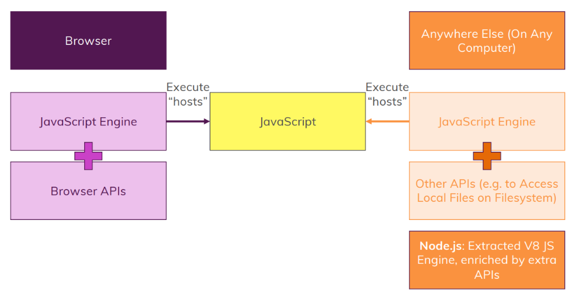
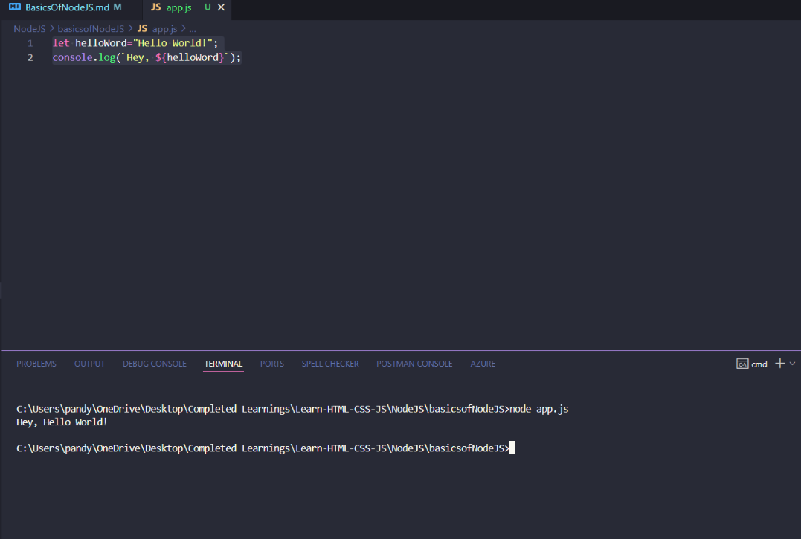

# About NodeJS





- Javascript is a hosted language, that means Javascript itself, the definition of the language can be implemented in different browser environments. All you need in the end is a Javascript engine that parses the code and executes it in the end in browser. Browsers have their own Javascript engines, like the V8 engine in the case of Chrome and this in the end hosts and executes the Javascript code therefore. Now within the browser APIs we learned about, like the DOM or the browser storage or the fetch API and so on, so we got tools to build rich client-side applications where you utilize the language and all its key features and keywords and so on combined with the browser APIs to provide the user experience you want to provide, all of that then runs in the browser.

>[!NOTE]
> - In the context of web development, a **client-side application** essentially refers to an application that runs within a user's web browser, making the browser itself the "client" in this scenario; therefore, a client-side application is considered to be **browser-based** or simply **browser** in this context. 

- We can execute Javascript anywhere else we want by simply taking the Javascript engine and taking it out of the browser basically and that's it. We can then add our own APIs if we want to, not APIs to work with the DOM for example because if the browser environment is detached from the web page, there is no DOM right, there is no HTML code which we could parse.
- APIs which don't exist in the browser, for example to work with the local file system which is not possible in the browser due to security reasons and that's exactly what `Node.js` does to run Javascript. `Node.js` is essentially the extracted V8 engine Chrome offers enriched by extra APIs, so its that engine you know from the browser but basically instead of the browser APIs, it has access to other APIs and it runs outside of the browser, this is `Node.js`.
- Lets create a simple **app.js** file and add below javascript code

```
let helloWord="Hello World!";
console.log(`Hey, ${helloWord}`);
```

- Now to execute your javascript file you need to run the command `node filename.js`



## Import and Exports

- `Node.js` and browser environments handle module imports and exports differently.
- Originally, `Node.js` used the CommonJS module system, which relies on the `require()` function to `import` modules and `module.exports` or `exports` to export them.
- Lets create another file **app1.js**

```
export function add(a,b){
    return a+b;
}
```

- In **app.js**

```
let helloWord="Hello World!";
console.log(`Hey, ${helloWord}`);

// Importing Local module
const app1JS=require('./app1.js');
console.log(app1JS.add(6,10));
```

- Output

```
Hey, Hello World!
16
```

- Lets add a `subtract` function as well, so in **app1.js**

```
export function add(a,b){
    return a+b;
}

export function sub(a,b){
    return a-b;
}
```

- In **app.js**

```
let helloWord="Hello World!";
console.log(`Hey, ${helloWord}`);

// Importing Local module
const app1JS=require('./app1.js');
console.log(app1JS.add(6,10));

const {add,sub} = require('./app1.js');
console.log(add(10,5));
console.log(sub(10,5));
```

- Output

```
Hey, Hello World!
16
15
5
```

- `Node.js` also consist of some built in modules, like for file system we have `fs` module.

```
const fileSys=require('fs');

// Writing data ('This contents needs to be written inside the file') into file dummyText.txt, if any error occurred , will get printed out
fileSys.writeFile("dummyText.txt","This contents needs to be written inside the file",(ifAnyError)=>{
    if(ifAnyError) console.log(ifAnyError)
})

//Reading data from file
fileSys.readFile("dummyText.txt",(error,filedata)=>{
    if(error){
        console.log(error);
        return; //Stopped reading further contents from file
    }
    console.log(filedata.toString());
})
```


